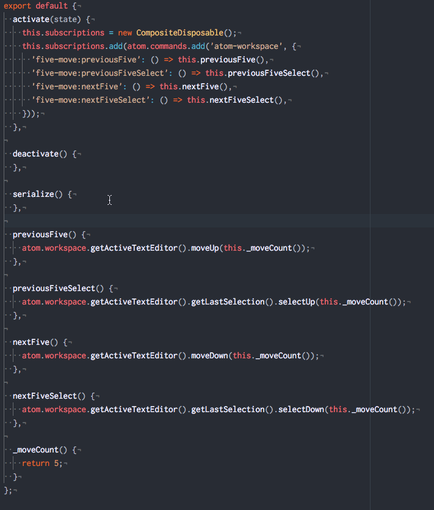

# five-move package

move (or select) 5 lines.

[](https://atom.io/packages/five-move)

## :video_camera: Demo



## :floppy_disk: Install

```
$ apm install five-move
```

## :scroll: Usage
|shortcut|memo|
|:--|:--|
|alt-j|move previous 5 lines|
|alt-shift-j|select previous 5 lines|
|alt-k|move previous 5 lines|
|alt-shift-k|select previous 5 lines|
